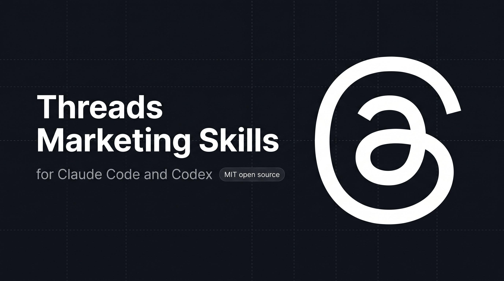

<p align="center">
  
</p>

# Threads Marketing Skills for Claude Code and Codex

<p align="center">
  
  
  
  
  
  
  
</p>

5 skills that help Claude Code and Codex write posts, threads, and replies on Threads (Meta) in your voice. They draft content, strip AI tells, and wait for your approval before anything gets published. No coding required.

## Install

Pick whichever way you use Claude Code or Codex:

### Codex CLI

```bash
codex plugin marketplace add sergebulaev/threads-skills
codex plugin add threads-skills@threads-skills
```

To test a local clone before publishing changes:

```bash
git clone https://github.com/sergebulaev/threads-skills.git
cd threads-skills
codex plugin marketplace add .
codex plugin add threads-skills@threads-skills
```

### claude.ai (web)

1. Open https://claude.ai/code
2. Go to **Skills** in the sidebar
3. Click **Add from GitHub**
4. Paste: `sergebulaev/threads-skills`
5. Done. The skills activate automatically when you ask about Threads.

### Claude Desktop (Mac / Windows)

1. Open Claude Desktop
2. Open **Settings** (gear icon)
3. Go to **Skills**
4. Click **Add from GitHub**
5. Paste: `sergebulaev/threads-skills`
6. Done. Start a new conversation and ask Claude to write a Threads post.

### Claude Code (CLI / VS Code / JetBrains)

```
/plugin marketplace add sergebulaev/threads-skills
/plugin install threads-skills@threads-skills
```

Or clone the repo and open it as your working directory:

```bash
git clone https://github.com/sergebulaev/threads-skills.git
cd threads-skills
```

### Any agent (skills CLI)

One command that works across Claude Code, Codex, Cursor, and any other agent that reads SKILL.md files:

```bash
npx skills add sergebulaev/threads-skills
```

## What you can do

Once installed, just ask Claude Code or Codex for help with Threads. The right skill activates automatically.

**Write a post:**
> "Write me a Threads post about why most AI agents fail on retries, not reasoning. Keep it warm."

**Turn an idea into a thread:**
> "Turn my notes into a Threads thread on how we cut agent latency from 9s to 2.1s."

**Check a draft before posting:**
> "Audit this Threads post for AI tells and the 500-char limit: [paste your text]"

**Reverse-engineer a viral post:**
> "What hook does this thread use? https://www.threads.net/@someone/post/abc (I'll paste the text)"

**Reply to a creator:**
> "Draft a reply to this Threads post, I want to add value not dunk: https://www.threads.net/@someone/post/abc"

**Plan your week:**
> "Plan a week of Threads content. I'm building an AI agent in public for indie devs."

Every skill shows you a draft first and waits for your OK. Nothing gets posted without your approval.

## The 5 skills

| Skill | What it does |
|---|---|
| **Post Writer** | Drafts a single Threads post or a multi-post thread using a 2026 Threads hook formula picked by goal: replies, reposts, likes, or quotes. Respects the 500-char limit (10,000 with a text attachment) and the one-hashtag cap |
| **Humanizer** | Strips em dashes, AI vocabulary ("leverage", "delve", "harness"), rule-of-three lists, and uniform post rhythm. Bundles a `--mode audit` pre-publish check (500-char fit, hook, one-hashtag cap, link placement, warm tone) |
| **Hook Extractor** | Reverse-engineers the hook from any viral Threads post or thread. Maps it to one of the 10 Threads formulas and returns a blank template you can fill |
| **Reply Drafter** | Drafts a reply or a value-add quote post for any Threads post URL. Decides reply vs quote post. A reply to another user is a separate post, so the draft comes back as a copy-paste block |
| **Content Planner** | Creates a weekly plan with a single-to-thread mix, per-day hooks, posting times, daily reply targets, and a goal-mix balance check |

## How threads work on Threads

Threads caps a post at **500 characters** (10,000 if you attach the longer-form text). For anything longer, you build a multi-post thread. Doing that on the native Threads API means creating a container for post 1, publishing it, then creating each next post with a `reply_to_id` pointing at the previous one, and handling partial failures.

This bundle hands the whole chain to [Publora](https://publora.com). You write the thread as one block (or split it with `---`), and Publora auto-splits it into a connected multi-post thread at paragraph then sentence boundaries, and posts it in one call. Unlike X, Threads does not add `(1/N)` markers by default. The Post Writer skill uses this on approval.

## Optional: auto-post with Publora

By default, the skills draft content for you to copy-paste into Threads. If you want Claude Code or Codex to publish posts and threads directly, connect Publora. It takes about 2 minutes.

### What is Publora?

[Publora](https://publora.com) is a publishing API that turns one `create-post` call into a full Threads thread (and can cross-post the same content to X, LinkedIn, Instagram, and more).

### Setup (2 minutes)

**Step 1.** Sign up at https://app.publora.com/signup (free)

**Step 2.** Connect Threads: click **Channels** in the left sidebar, then **Add Channel**, pick **Threads**, authorize.

**Step 3.** Find your Platform ID: go to **Channels**, click your Threads account. The ID looks like `threads-17841412345678`. Copy the whole thing including `threads-`.

**Step 4.** Get your API key: click **Settings** (gear icon, bottom-left), then **API**, then **Create Key**. Copy the `sk_...` string.

**Step 5.** Create a file called `.env` in the threads-skills folder:

```
PUBLORA_API_KEY=sk_paste_your_key_here
THREADS_PLATFORM_ID=threads-paste_your_id_here
```

If you cloned the repo, copy the template instead:

```bash
cp .env.example .env
```

Then open `.env` and replace the placeholders with your real values.

**Step 6.** Install two small Python packages:

```bash
pip install requests python-dotenv
```

**Step 7.** Test it. Ask Claude Code or Codex:

> "Schedule a test Threads post via Publora 24 hours from now: 'testing the API connection, will cancel in dashboard'."

If Publora returns a `postGroupId`, you're set. Cancel the post in the Publora dashboard before the scheduled time. If you get HTTP 401, your API key is wrong. If you get a `Invalid platform ID format` error, your `THREADS_PLATFORM_ID` is wrong. See [Troubleshooting](#troubleshooting).

> **Note on replies:** a reply to another user's post is a separate post that Publora's `create-post` cannot target, so the Reply Drafter always returns its draft as a copy-paste block for you to post yourself. Single posts and your own threads auto-publish.

## Voice rules

Every skill follows these rules automatically:

1. No em dashes. Biggest AI tell in 2026.
2. Capitalize names. Always. Lowercase a brand reads as careless.
3. No AI vocabulary: "leverage", "fundamentally", "streamline", "harness", "delve", "unlock", "foster".
4. Specific numbers beat adjectives. "2.4x" beats "way better".
5. One idea per post. The first line carries everything (the feed truncates with "more").
6. 500 chars per post. 0-1 hashtag (Threads allows only one), 0-2 emoji.
7. Warm and conversational, not a transplanted X dunk.

## Troubleshooting

| Problem | Fix |
|---|---|
| Skills don't activate when I ask about Threads | Make sure you installed via the Skills panel, `/plugin install`, or `codex plugin add`. Try a new conversation. |
| "PUBLORA_API_KEY not set" | Your `.env` file is missing or in the wrong folder. It should be in the `threads-skills/` root. |
| "401 Invalid API key" from Publora | Your API key is wrong or revoked. Go to Publora Settings > API > Create a new key. |
| "Invalid platform ID format" | Your `THREADS_PLATFORM_ID` is wrong. Go to Publora Channels and copy the full `threads-...` string. |
| My second hashtag disappeared | Threads allows only one hashtag per post. The platform drops extras. Use one, at the end. |
| My thread didn't post as connected posts | Multi-post nesting can be temporarily paused while Meta works through Threads app reconnection. Post the opener, then add the rest as replies by hand. |
| My reply didn't auto-post | A reply to another user is a separate post Publora cannot target. The Reply Drafter returns a copy-paste block. Post it yourself. |
| `pip install` fails | Use a virtual environment: `python -m venv venv && source venv/bin/activate && pip install requests python-dotenv` |

## Cross-cutting references

- [`references/hook-formulas.md`](references/hook-formulas.md) - the 10 Threads hook formulas with skeletons and goal tags
- [`references/algorithm-heuristics.md`](references/algorithm-heuristics.md) - 2026 Threads ranking signals, timing, and limits
- [`references/voice-rules.md`](references/voice-rules.md) - the canonical voice rules every skill inherits

---

<details>
<summary><b>For developers: runtime compatibility, URL parsing, and internals</b></summary>

## Runtime compatibility

```
threads-skills/
  skills/             SKILL.md frontmatter; native to Claude Code and Codex, others read as markdown
  .codex-marketplace/ generated nested Codex package (run scripts/sync_codex_marketplace.py)
  lib/                pure Python, works in any agent runtime
  references/         pure markdown, works anywhere
  scripts/            pure Python CLI, works anywhere
```

| Runtime | Auto-discovers skills? | Setup |
|---|---|---|
| **Claude Code** (CLI, Desktop, Web, IDE) | Yes | Install via plugin or clone. Skills activate on matching prompts. |
| **Codex CLI** | Yes | `codex plugin marketplace add sergebulaev/threads-skills` and `codex plugin add threads-skills@threads-skills`. |
| **Anthropic Managed Agents** (`/v1/agents`) | Yes | Pass skill files in the agent context. |
| **Cursor / Cline / Aider** | Manual | Read `SKILL.md` files as prompt context; import `lib/` as Python. |
| **LangChain / AutoGen** | No | Use `lib/` as a package; feed `references/` as prompt context. |

## Generic Python agent quickstart

```python
import sys; sys.path.insert(0, "path/to/threads-skills")
from lib import parse_threads_url, PubloraClient, publish

parsed = parse_threads_url("https://www.threads.net/@zuck/post/C8H9abcDEf_")
print(parsed["handle"], parsed["post_id"])  # zuck C8H9abcDEf_

# Write side (Publora) - a single post or a thread (long content auto-splits)
client = PubloraClient()  # reads PUBLORA_API_KEY from env
client.create_post(
    content="First post of the thread\n\n---\n\nSecond post\n\n---\n\nThird post",
    platforms=["threads-17841412345678"],
)

# Or use the high-level wrapper that handles manual / Publora / diy routing
publish("thread", draft_text="...", target_url="https://www.threads.com/",
        platforms=["threads-17841412345678"])
```

## URL handling

`lib/url_parser.py` parses Threads post and profile URLs on both hosts:

| URL fragment | Parsed |
|---|---|
| `threads.net/@HANDLE/post/CODE` | `{handle, post_id, url_type: "post"}` |
| `threads.com/@HANDLE/post/CODE` | same (normalized to threads.com) |
| `threads.com/@HANDLE` | `{handle, url_type: "profile"}` |

```bash
python lib/url_parser.py "https://www.threads.net/@zuck/post/C8H9abcDEf_"
```

## Why a reply is a separate post

LinkedIn flattens reply threads to 2 levels and needs the top-level comment URN as the parent. Threads does not: replies nest naturally and there is no parent-comment URN to resolve. The Reply Drafter therefore just drafts the text. Publora's `create-post` cannot target another user's post, so reply publishing is a copy-paste step by design.

</details>

## References

- [Publora API docs](https://docs.publora.com) - endpoint reference for the publishing layer
- [Threads API (Meta for Developers)](https://developers.facebook.com/docs/threads/) - the official Threads Graph API behind the 2026 heuristics

## License

MIT. Powered by [Publora](https://publora.com).

## Related open-source skill bundles

Part of a family of AI social-media marketing skill bundles for Claude Code and Codex:

- [linkedin-skills](https://github.com/sergebulaev/linkedin-skills) - LinkedIn
- [x-skills](https://github.com/sergebulaev/x-skills) - X (Twitter)
- [instagram-skills](https://github.com/sergebulaev/instagram-skills) - Instagram
- [youtube-skills](https://github.com/sergebulaev/youtube-skills) - YouTube
- **threads-skills - Threads (this repo)**
- [tiktok-skills](https://github.com/sergebulaev/tiktok-skills) - TikTok
- [facebook-skills](https://github.com/sergebulaev/facebook-skills) - Facebook Pages

Also: [Anthropic Skills repo](https://github.com/anthropics/skills), the `awesome-claude-skills` directory.
